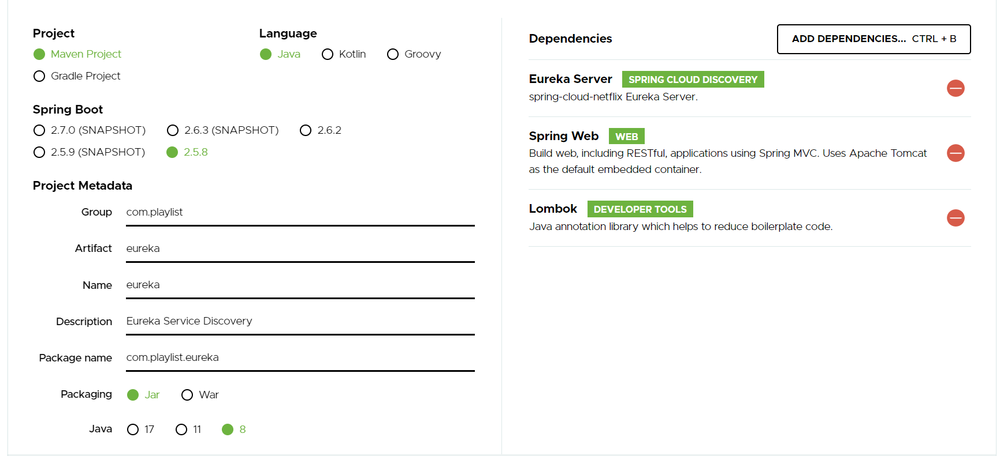
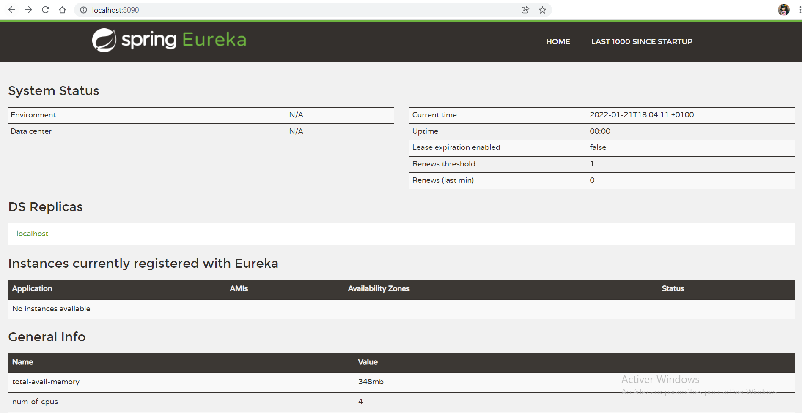
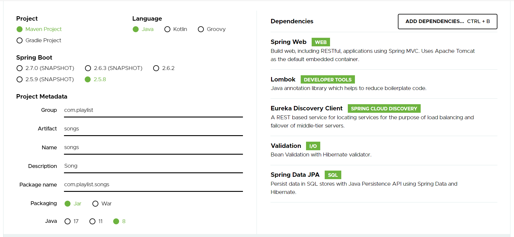

# Spring boot avec Spring Cloud
Dans ce tutoriel, il s’agira de voir comment nous créons un projet en se basant sur une architecture de microservices dans un écosystème Spring Cloud.

Pour ce faire, nous allons créer une application simple de playlists et vous montrer étape par étape, comment nous l’avons implémentée avec Spring Cloud.

Mais avant de commencer le développement, laissez-nous vous expliquer :
* C'est quoi une architecture **monolothique**, **SOA** et **microservice** ?
* Quelle est la différence entre **SOA** et **microservices** ?

## Définition de concepts clés

### 1. Architecture Monolithique
Il s'agit d'une application formé d'un seul bloc c'est-à-dire toutes les tâches sont réalisées dans une seule et grande application.

L'application dépend d'une base de données unique.

Ce type d'application possède un code source assez volumineux, et par la suite ça devient difficile de l'enricher et de traiter rapidement les problèmes qui surviennent.

Du coup, nous trouvons que les composants d'une application monolithique sont fortement interconnectés : **Couplage fort**

Mais, Ce type d'architecture est idéale pour le développement d'applications petites et simples, 

### 2. Architecture SOA (Service Oriented Architecture)
L'architecture orientée service s'appuie sur un ensemble de services.

Chaque service a un nombre de fonctionnalités cohérentes.

Chaque service est indépendant des autres services.

Ces services communiquent entre eux via le protocole SOAP basé sur XML. 

La communication peut impliquer soit un simple transfert de données, soit deux ou plusieurs coordonnant une activité.

### 3. Architecture de microservices
Est un style architectural, qui consiste à diviser une grande application en plusieurs services plus petits, autonomes et modélisés autour d'un domaine métier

Chaque service exécute sa taches correspondantes pour assurer le bon fonctionnement de l'ensemble du système.

Chaque service possède sa propre base de données.

Chaque microservice a un périmètre fonctionnel qui peut être relié à la notion de **contexte délimité (bounded context)** issue de l'approche de conception pilotée par domaine **DDD (Domain Driven Design) : est une méthode de conception utilisée pour construire des systèmes qui ont un domaine métier complexe.**

Un microservice est censé de bénéficier d'une forte cohésion interne.

Les microservices sont censé de bénéficier d'un couplage faible : car les services sont hautement indépendants c'est-à-dire que chaque service epeut être développé, deployé et testé indépendamment.

Ce type d'architecture, nous permet d'identifier facilement les erreurs et de tester et déployer les modifications.

### 4. La différence entre une Architecture SOA et microservices
Ces deux architectures s'appuient sur des services en tant que composant principal.

La différence se résume à trois points : 

* **La portée** :
    * **SOA** a une portée d'entreprise
    * **Microservice** a une portée d'application
    
* **La communication**
    * **SOA** : Chaque service doit partager un mécanisme de communication commun
    * **Microservice** : Chaque service est développé indépendamment avec son propre protocole de communication.
    
* **L'évolutivité** : L'architecture **microservice** est plus évolutive que l'**architecture orientée service**.
    
## L’application Playlists en microservice

### 1. Présentation de l’application Playlists
L’application Playlists affiche des informations sur une chanson.

Elle est composée de deux microservices distincts:

* **Songs** – ce microservice appelle le microservice Details pour récupéer les informations supplémentaire de la chanson.
* **Détails** – c’est le microservice qui contient des informations sur les chansons.

### 2. Découverte de services & Équilibrage de charge
Le système de découverte de services et d’équilibrage de charge, nous permet de assurer un couplage lâche et une communication inter-microservices fluide. 

De sorte que les microservices puissent à tout moment connaître la liste de tous les microservices en cours d’exécution.

L’équilibrage de charge et la découverte de service dans Spring Cloud se fait avec les deux composants suivants :

### 2.1  Serveur de discovery
C'est où tous les microservices s’enregistrent tout en renseignant leurs informations d’identification et de routage: nom, adresse IP et numéro de port

Dans notre cas, nous allons utiliser le service de discovery : **Eureka**

* #### Configuration d'un serveur de découverte - Eureka Project

Nous allons créer une application Spring Boot au sein de laquelle, nous allons embarquer un serveur eureka.



Pour cela, il faut d’ajouter la dépendance suivante au niveau du fichier **eureka/pom.xml**

```xml
<dependencies>
	<dependency>
		<groupId>org.springframework.boot</groupId>
		<artifactId>spring-boot-starter-web</artifactId>
	</dependency>
	<dependency>
		<groupId>org.springframework.cloud</groupId>
		<artifactId>spring-cloud-starter-netflix-eureka-server</artifactId>
	</dependency>

	<dependency>
		<groupId>org.projectlombok</groupId>
		<artifactId>lombok</artifactId>
		<optional>true</optional>
	</dependency>
	<dependency>
		<groupId>org.springframework.boot</groupId>
		<artifactId>spring-boot-starter-test</artifactId>
		<scope>test</scope>
	</dependency>
</dependencies>
```

Il faut annoter la classe principale **eureka/src/main/java/com/playlist/eureka/EurekaApplication.java** avec **@EnableEurekaServer**.

```java
@EnableEurekaServer
@SpringBootApplication
public class EurekaApplication {

	public static void main(String[] args) {
		SpringApplication.run(EurekaApplication.class, args);
	}

}
```

Eureka par défaut s'enregistre dans le discovery et pour désactiver ce comportement, il faut ajouter les lignes ci-dessous dans le fichier de configuration **eureka/src/main/resources/application.properties**

```yaml
eureka.client.register-with-eureka=false
eureka.client.fetch-registry=false

server.port=8090
```
#### L'exécution du serveur de découverte - Eureka Project

L'exécution sera sur http://localhost:8090



### 2.2  Client discovery
C'est une dépendance à importer et à configurer au niveau de chaque microservice afin que celui-ci puisse communiquer avec le serveur de discovery et faire le load balancing

* #### Configuration d’un client discovery avec Spring Boot

Pour intégrer les clients discovery au niveau de chacun des microservices Songs et Details, il faut ajouter cette dépendance :

```xml
<dependency>
			<groupId>org.springframework.cloud</groupId>
			<artifactId>spring-cloud-starter-netflix-eureka-client</artifactId>
</dependency>
```

   * ##### Microservice Songs
   


**1. Avec Rest Template**
   
**songs/pom.xml**

```xml
<dependencies>
		<dependency>
			<groupId>org.springframework.boot</groupId>
			<artifactId>spring-boot-starter-data-jpa</artifactId>
		</dependency>
		<dependency>
			<groupId>org.springframework.boot</groupId>
			<artifactId>spring-boot-starter-validation</artifactId>
		</dependency>
		<dependency>
			<groupId>org.springframework.boot</groupId>
			<artifactId>spring-boot-starter-web</artifactId>
		</dependency>
		<dependency>
			<groupId>org.springframework.cloud</groupId>
			<artifactId>spring-cloud-starter-netflix-eureka-client</artifactId>
		</dependency>

		<dependency>
			<groupId>org.projectlombok</groupId>
			<artifactId>lombok</artifactId>
			<optional>true</optional>
		</dependency>
		<dependency>
			<groupId>org.springframework.boot</groupId>
			<artifactId>spring-boot-starter-test</artifactId>
			<scope>test</scope>
		</dependency>
        <dependency>
            <groupId>org.hibernate</groupId>
            <artifactId>hibernate-envers</artifactId>
        </dependency>
		<dependency>
			<groupId>org.postgresql</groupId>
			<artifactId>postgresql</artifactId>
		</dependency>
    </dependencies>
```
Il faut annoter la classe principale **songs/src/main/java/com/playlist/songs/SongsApplication.java** avec **@EnableDiscoveryClient** et créer un Bean RestTemplate avec l'annotation **@LoadBallancer**

```java
@EnableDiscoveryClient
@SpringBootApplication
public class SongsApplication {

	@Bean
	@LoadBalanced
	RestTemplate restTemplate() {
		return new RestTemplate();
	}

	public static void main(String[] args) {
		SpringApplication.run(SongsApplication.class, args);
	}

}
```

Configurer le fichier de configuration **songs/src/main/resources/application.properties**

```yaml
eureka.client.service-url.default-zone = http://localhost:8090/eureka/

spring.application.name=songs

spring.datasource.url=jdbc:postgresql://localhost:5432/songs_db
spring.datasource.username=playlistadmin
spring.datasource.password=admin


spring.jpa.properties.hibernate.dialect = org.hibernate.dialect.PostgreSQLDialect

spring.jpa.hibernate.ddl-auto=update
```

Créer une classe **songs/src/main/java/com/playlist/songs/client/DetailsClient.java**

```java
@Service
public class DetailsClient {

    private RestTemplate restTemplate;

    public DetailsClient(RestTemplate restTemplate) {
        this.restTemplate = restTemplate;
    }

    public Details getDetailBySongId(@PathVariable Long id) {
        return restTemplate.getForObject("http://details/details/"+id, Details.class);
    }
}
```

**2. Avec Feign Client**

Ajouter cette dépendance dans le fichier **songs/pom.xml**

```xml
<dependency>
    <groupId>org.springframework.cloud</groupId>
    <artifactId>spring-cloud-starter-openfeign</artifactId>
</dependency>
```
